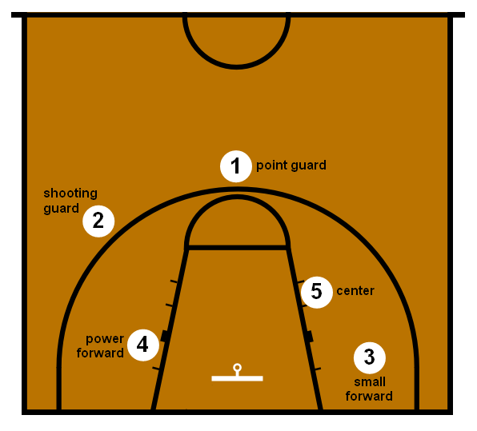
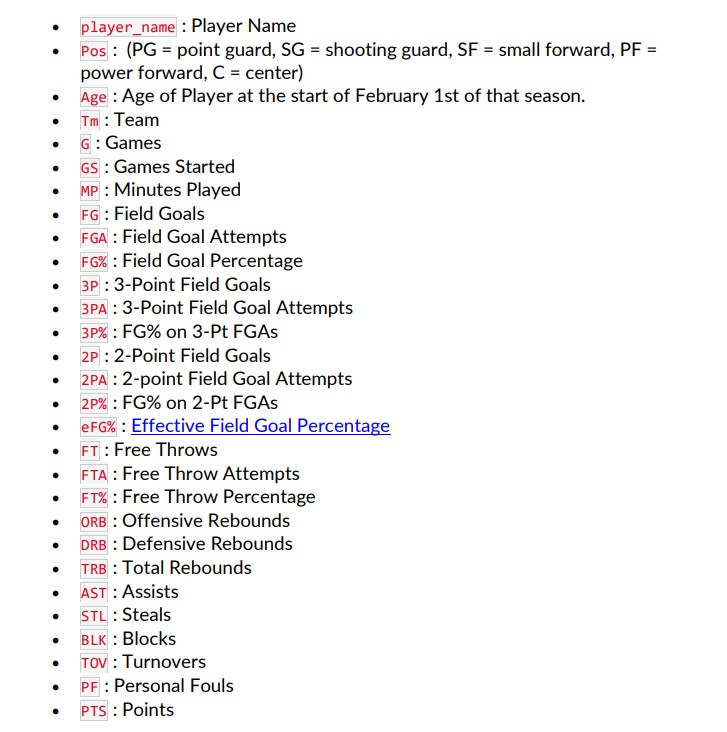
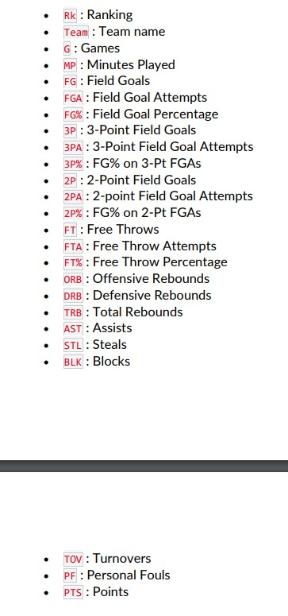
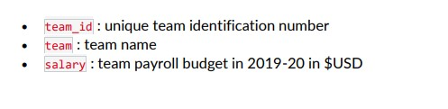

# Reproducible Data Analysis Project


## Introduction

Basketball is a popular team sport where two teams, each consisting of five players on the court, compete against each other by shooting a ball through a hoop to score points. The objective of the game is to score more points than the opposing team within a fixed time frame. Key metrics and position requirements in basketball are essential in evaluating player performance and building a successful team.

#### Relevant background information of basketball, including key metrics, position requirements etc:

In basketball, players are categorized into five positions, each with unique roles and responsibilities: point guard (PG), shooting guard (SG), small forward (SF), power forward (PF), and center (C). Key performance metrics include points, rebounds, assists, steals, blocks, and turnovers, which help evaluate a player's overall effectiveness on the court. Advanced metrics like Player Efficiency Rating (PER) and Win Shares (WS) provide more comprehensive evaluations of a player's contributions to the team's success.

 [1]

### Description of the scenario:

The general manager of a professional basketball team is looking to build a competitive roster while staying within the salary cap limitations. The team needs to find the best starting five players within their budget, taking into account player performance metrics, positions, and salary demands. [2]

## The aim of the project:

The primary goal of this project is to analyze basketball player performance data, including advanced metrics, positions, and salaries, to provide data-driven recommendations for selecting the optimal starting five players within the team's budget constraints.

## Justification and importance:

By leveraging data analysis and modeling techniques, this project can help the team make informed decisions on player acquisitions, ensuring the best possible roster composition while staying within the salary cap. This approach not only improves the team's competitiveness on the court but also ensures financial sustainability in a highly competitive professional sports environment. Furthermore, the insights gained from this analysis can be used by other teams to make more informed decisions when building their rosters.

## Reading and cleaning the raw data

### NBA Player Salaries

```{r echo=FALSE}
    library(tidyverse)
    library(readr)
    player_salaries <- read_csv("data/2018-19_nba_player-salaries.csv", show_col_types = FALSE)
    head(player_salaries)
```

The above dataset has 3 columns, Id of the player, name and the salary of the player. Lets check for NA values


### NBA Player Statistics

```{r echo=FALSE}
    player_stats <- read_csv("data/2018-19_nba_player-statistics.csv", show_col_types = FALSE)
    head(player_stats)
```


The above dataset shows the statistics of each player.


### NBA Team Statistics 1

```{r echo=FALSE}
    team_stats_1 <- read_csv("data/2018-19_nba_team-statistics_1.csv", show_col_types = FALSE)
    head(team_stats_1)
```

### NBA Team Statistics 2

```{r echo=FALSE}
    team_stats_2 <- read_csv("data/2018-19_nba_team-statistics_2.csv", show_col_types = FALSE)
    head(team_stats_2)
```

The above dataset shows the statistics of Teams.

{width="387"}


### NBA Player Salaries

```{r echo=FALSE}
    team_payroll<-read.csv("data/2019-20_nba_team-payroll.csv")
    head(team_payroll)
```

The above dataset shows Team Payroll or the budget for the next season 

```{r echo=FALSE}
    sum(is.na(team_payroll))
```

There are 0 NA values in this dataset NBA player salaries.

## Exploratory analysis

### A) Checking for errors and missing values within the datasets

```{r echo=FALSE}
count_and_replace_na <- function(df) {
  cat(paste0("Number of NA values in the dataframe: ", sum(is.na(df))), "\n")
  df[is.na(df)] <- 0
  return(df)
}

# Use the function on your dataframes
team_payroll <- count_and_replace_na(team_payroll)
player_salaries <- count_and_replace_na(player_salaries)
player_stats <- count_and_replace_na(player_stats)
team_stats_1 <- count_and_replace_na(team_stats_1)
team_stats_2 <- count_and_replace_na(team_stats_2)
```
1. Zero NA valuesin team_payroll and player salaries.
2. We have replace 117 NA values of team_stats_1 data to 0.
3. We have replace 90 NA values of team_stats_1 data to 0.
4. There are no NA values in team_stats_2.


### B and C : Checking the distribution of variables &  checking for relationships between variables, or differences between groups

1. Distribution of player salaries

```{r echo=FALSE}
library(ggplot2)

fig1 <- ggplot(player_salaries, aes(x = salary/1000000)) +
  geom_histogram(fill = "lightblue", colour = "black") +
  scale_x_continuous(breaks = seq(0, 40, by = 4)) +
  labs(title = "Distribution of Player Salaries", x = "Salary in Million USD", y = "Number of Players") +
  theme(panel.grid.major = element_blank(), panel.grid.minor = element_blank(),
panel.background = element_blank(), axis.line = element_line(colour = "black")) #[4]
fig1
ggsave("Figs/Distribution of player salaries.png", fig1, width = 720/72, height = 1280/72, dpi = 72)
```

Salaries of the players are is distributed in the positively skewed manner


2. Top 15 players by points scored

```{r echo=FALSE}

top_scorers <- player_stats %>%
  top_n(15, PTS)

fig2 <- ggplot(top_scorers, aes(x = reorder(player_name, PTS), y = PTS, fill = PTS)) +
  geom_bar(stat = "identity", colour = "black") +
  coord_flip() +
  scale_fill_gradient(low = "yellow", high = "red") +   #[5]    
  labs(title = "Top 15 Players by Points Scored", x = "Player", y = "Points") +
  theme(panel.grid.major = element_blank(), panel.grid.minor = element_blank(),
panel.background = element_blank(), axis.line = element_line(colour = "black")) #[4]
fig2
ggsave("Figs/Top 15 players by points scored.png", fig2, width = 720/72, height = 1280/72, dpi = 72)

```

James Harden, Paul George, Kemba Walker. are the most point scored players. Also, We may have a probable outlier James Harden, since points scored is way off the charts compared to other top players.


3. Player positions distribution

```{r echo=FALSE}

fig3 <- ggplot(player_stats, aes(x = Pos, fill = Pos)) +
  geom_bar(colour = "black") +
  labs(title = "Player Positions Distribution", x = "Position", y = "Number of Players") +
  theme(panel.grid.major = element_blank(), panel.grid.minor = element_blank(),
panel.background = element_blank(), axis.line = element_line(colour = "black"))
fig3
ggsave("Figs/Player positions distribution.png", fig3, width = 720/72, height = 1280/72, dpi = 72)

```

Player positions distribution.


4. Scatterplot of points vs. player efficiency rating

```{r echo=FALSE}

# Calculate the player efficiency rating
player_stats <- player_stats %>%
  mutate(PER = (PTS + TRB + AST + STL + BLK - FGA - FTA + TOV) / G)


fig4 <- ggplot(player_stats, aes(x = PTS, y = PER)) +
  geom_point(alpha = 0.5,color='darkred') +
  labs(title = "Scatterplot of Points vs. Player Efficiency Rating", x = "Points Scored", y = "Player Efficiency Rating") +
  geom_smooth(method = "lm") +
  theme(panel.grid.major = element_blank(), panel.grid.minor = element_blank(),
panel.background = element_blank(), axis.line = element_line(colour = "black")) #[4]
fig4
ggsave("Figs/Scatterplot of points vs. player efficiency rating.png", fig4, width = 720/72, height = 1280/72, dpi = 72)

```

Efficiency Rating is directly proportional to the points scored by the players.


5. Player efficiency rating vs. salary

```{r echo=FALSE}

player_stats_salaries <- merge(player_stats, player_salaries, by = "player_name")

#instead of Using e values that doesn't make sense, we used salary in millions by dividing and converting the value 
fig5 <- ggplot(player_stats_salaries, aes(x = salary/1000000, y = PER)) + 
  geom_point(alpha = 0.5,color='darkred') +
  geom_smooth(method = "lm") +
  labs(title = "Player Efficiency Rating vs. Salary", x = "Player Salary in Million USD", y = "Player Efficiency Rating") +
  theme(panel.grid.major = element_blank(), panel.grid.minor = element_blank(),
panel.background = element_blank(), axis.line = element_line(colour = "black")) ##[4]
fig5
ggsave("Figs/Player efficiency rating vs. salary.png", fig5, width = 720/72, height = 1280/72, dpi = 72)

```

Efficiency Rating is directly proportional to the salaries of  the players.


6. Top 15 most efficient players within budget

```{r echo=FALSE}

efficient_players <- player_stats_salaries %>%
  filter(salary < (118000000 / 15)) %>%
  top_n(15, PER)

fig6 <- ggplot(efficient_players, aes(x = reorder(player_name, PER), y = PER)) +
  geom_bar(stat = "identity", fill = "lightblue", colour = "black") +   #[6]
  coord_flip() +
  labs(title = "Top 15 Most Efficient Players within Budget", x = "Player Name", y = "Player Efficiency Rating") +
  theme(panel.grid.major = element_blank(), panel.grid.minor = element_blank(),
panel.background = element_blank(), axis.line = element_line(colour = "black")) #[4]
fig6
ggsave("Figs/Top 15 most efficient players within budget.png", fig6, width = 720/72, height = 1280/72, dpi = 72)

```

The bar graph shows the efficient players within the budget.
 

7. Top players by position within budget

```{r echo=FALSE}
# Assuming player_stats_salaries is a dataset containing player statistics and salary information
top_players_by_pos <- player_stats_salaries %>%
  filter(salary < (118000000 / 15)) %>%
  group_by(Pos) %>%
  top_n(1, PER)

fig7 <- ggplot(top_players_by_pos, aes(x = reorder(Pos, -PER), y = PER, label = player_name, fill = PER)) +
  geom_bar(stat = "identity") +
  geom_text(aes(y = PER - 0.5), angle = 90, hjust = 1, size = 2) +
  labs(title = "Top Players by Position within Budget Constraint",
       x = "Position",
       y = "Player Efficiency Rating (PER)") +
  scale_fill_gradient(low = "red", high = "yellow") +  #[5]
  theme(panel.grid.major = element_blank(), panel.grid.minor = element_blank(),
panel.background = element_blank(), axis.line = element_line(colour = "black")) #[4]
fig7
ggsave("Figs/Top players by position within budget.png", fig7, width = 720/72, height = 1280/72, dpi = 72)
```

The graph is sorted as per player efficiency rating that shows which player can be the best for their specific poisiton based on the budget and the salaries Karl-Anthony, Thon Maker, Jogn Collins, Jason Smith, Ben Simmons, Jakarr Sampson, Luke Doncic, Kyle Korver, Jonathon Simmons.


8. Boxplot of player efficiency rating by position

```{r echo=FALSE}
fig8 <- ggplot(player_stats, aes(x = Pos, y = PER, fill = Pos)) + #[5]
  geom_boxplot(colour = "black") +
  labs(title = "Boxplot of Player Efficiency Rating by Position", x = "Position", y = "Player Efficiency Rating") +
  theme(panel.grid.major = element_blank(), panel.grid.minor = element_blank(),
panel.background = element_blank(), axis.line = element_line(colour = "black")) #[4]
fig8
ggsave("Figs/Boxplot of player efficiency rating by position.png", fig8, width = 720/72, height = 1280/72, dpi = 72)
```

The above Boxplot proves our previous assumption about outliers, hence we can remove those outliers and move on to further analysis.


9. Scatterplot of player age vs. player efficiency rating

```{r echo=FALSE}
fig9 <- ggplot(player_stats, aes(x = Age, y = PER)) +
  geom_point(alpha = 0.5,color='darkred') +
  geom_smooth(method = "lm") +
  labs(title = "Scatterplot of Player Age vs. Player Efficiency Rating", x = "Age", y = "Player Efficiency Rating") +
  theme(panel.grid.major = element_blank(), panel.grid.minor = element_blank(),
panel.background = element_blank(), axis.line = element_line(colour = "black"))
fig9
ggsave("Figs/Scatterplot of player age vs. player efficiency rating.png", fig9, width = 720/72, height = 1280/72, dpi = 72)
```

Most of the players within the age group around 25-28 have similarly high efficiency, if we consider the regression line is least spread out near that age group.


10. Average Player Efficiency Rating by Team

```{r echo=FALSE}
avg_PER_by_team <- player_stats %>% group_by(Tm) %>% summarise(avg_PER = mean(PER))

fig10 <- ggplot(avg_PER_by_team, aes(x = reorder(Tm, avg_PER), y = avg_PER, fill = avg_PER)) +
  geom_bar(stat = "identity") +
  coord_flip() +                                           #[9]
  labs(title = "Average Player Efficiency Rating by Team", x = "Team", y = "Average Player Efficiency Rating(avg_PER)") +
  scale_fill_gradient(high = "blue", low = "yellow") +  #[5]
  theme(panel.grid.major = element_blank(), panel.grid.minor = element_blank(),
panel.background = element_blank(), axis.line = element_line(colour = "black"))  #[4]
fig10
ggsave("Figs/Average Player Efficiency Rating by Team.png", fig10, width = 720/72, height = 1280/72, dpi = 72)
```

10.1 Average Player Efficiency Rating by Team in comparison with Salaries

```{r echo=FALSE}
avg_PER_by_team <- player_stats_salaries %>% group_by(Tm) %>% summarise(avg_PER = mean(PER), avg_sal = mean(salary))

fig10.1 <- ggplot(avg_PER_by_team, aes(x = reorder(Tm, avg_PER), y = avg_PER, fill = avg_sal/1000000)) +
  geom_bar(stat = "identity") +
  coord_flip() +                                           #[9]
  labs(title = "Average Player Efficiency Rating by Team in comparison with salaries", x = "Team", y = "Average Player Efficiency Rating(avg_PER)") +
  guides(fill=guide_legend(title="Team's Avg Salary in Million")) +
  scale_fill_gradient(high = "red", low = "yellow") +  #[5]
  theme(panel.grid.major = element_blank(), panel.grid.minor = element_blank(),
panel.background = element_blank(), axis.line = element_line(colour = "black"))  #[4]
fig10.1
ggsave("Figs/Average Player Efficiency n salaries Rating by Team.png", fig10.1, width = 720/72, height = 1280/72, dpi = 72)
```

In the above plot, we can observe that most efficient players in team is not cost effective. Even so, we can't consider least expensive players, they doesn't seem to be efficient. Finding the sweet spot in the middle is our moto with the help of this project.


```{r echo=FALSE}
#Reusing the Code without rewriting it
library(ggplot2)  #[8]

create_and_save_plot <- function(df, x_var, y_var, plot_title, x_label, y_label, filename) {
  plot <- ggplot(df, aes_string(x = x_var, y = y_var)) +
    geom_point(alpha = 0.5, color = 'darkblue') +
    labs(title = plot_title, x = x_label, y = y_label) +
    theme_classic()

  ggsave(filename, plot, width = 720/72, height = 1280/72, dpi = 72)
  return(plot)
}


```

11.  Scatterplot of games played vs. player efficiency rating

```{r echo=FALSE}
fig11 <- create_and_save_plot(player_stats, "G", "PER", "Scatterplot of Games Played vs. Player Efficiency Rating", "Games Played", "Player Efficiency Rating", "Figs/Scatterplot of games played vs. player efficiency rating.png")

fig11
```


12.  Plotting relationship between the Field goals and Points

```{r echo=FALSE}
library(ggplot2)
fig12 <- create_and_save_plot(team_stats_2, "FG", "PTS", "Field Goals vs. Points", "Field Goals", "Points", "Figs/Field_goals_vs_Points.png")

fig12

```

It shows the positive correlation between these two varaibles2


13.  Plotting relationship between the 3point field Goals and Points

```{r echo=FALSE}
fig13 <- create_and_save_plot(team_stats_2, "`3P`", "PTS", "3-Point Field Goals vs. Points", "3-Point Field Goals", "Points", "Figs/3point_field_Goals_vs_Points.png")
fig13

```

It shows the positive correlation between these two varaibles


14.  Plotting relationship between the 2point field Goals and Points

```{r echo=FALSE}
fig14 <- create_and_save_plot(team_stats_2, "`2P`", "PTS", "2-Point Field Goals vs. Points", "2-Point Field Goals", "Points", "Figs/2point_field_Goals_vs_Points.png")
fig14

```

It shows the somewhat neutral relationship between the varaibles


15. Plotting relationship between the : Effective Field Goal Percentage and Points

```{r echo=FALSE}

fig15 <- create_and_save_plot(player_stats, "`eFG%`", "PTS", "Effective Field Goal Percentage vs. Points", "Effective Field Goal Percentage", "Points", "Figs/Effective_Field_Goal_Percentage_vs_Points.png")
fig15

```

Effective Field Goal Percentage is one of the important variable as it shows the positive relation with the Points scored.


Correlation Matrix of the analysed variables.

```{r echo = FALSE}

df <- merge(team_stats_1, team_stats_2, by = "Team")
res <- cor(df[ , (names(df) %in% c('Age','FG','X3P','X2P','FT','BLK','STL','AST','TOV','eFG.','PTS'))])
res2 <- Hmisc::rcorr(as.matrix(res))
corrplot::corrplot(res, type = "upper", order = "hclust", 
        tl.col = "black")
```

1.  Salaries of the players are is distributed in the positively skewed manner [10].
2.  James Harden, Paul George, Kemba Walker. are the most point scored players.
3.  Player positions distribution.
4.  Efficiency Rating is directly proportional to the points scored by the players.
5.  Efficiency Rating is directly proportional to the salaries of  the players.
6.  The bar graph shows the efficient players within the budget.
7.  The graph shows which player can be best for the specific poisiton based on the budget and the          salaries/- Karl-Anthony, Thon MAker, Jogn Collins, Jason Smith, Ben Simmons, Jakarr Sampson, Luke       Doncic, Kyle Korver, Jonathon Simmons.
8.  Mostly players within the age group within 22-26 are having higher efficiency

From the above analysis we can say that Field goals, 3point field Goals, 2point field Goals,Free Throws, Block, Effective Field Goal Percentage are the important factors with decides the points of the team as well as the winning probability. Lets build the model.

We began by cleaning and preprocessing the data to ensure its integrity and reliability. This included handling missing values, eliminating outliers, and merging the datasets to create a comprehensive source of information.

Next, we conducted an exploratory data analysis to understand the distributions of various metrics, identify relationships between variables, and detect any potential issues or biases. We examined factors such as player performance, age, and salary, and used visualizations to gain insights into the data.

We then proceeded to model the data, using advanced statistical techniques such as linear regression and hierarchical clustering. This allowed us to identify patterns and relationships in the data that would guide our player selection process.

Based on our findings, we have recommended a starting lineup that not only meets the budget constraints but also offers a balanced and strong team composition. We have considered the strengths and weaknesses of each player, their respective positions, and their performance statistics to make an informed decision.


## Data modelling and results

### Data modelling (e.g. creating a linear regression)
So if We run Linear Regression Model these variables to see how good they are in predicting the Points of model. [11]

```{r echo = FALSE}
    # Choose relevant features
    features <- c("MP", "PTS", "TRB", "AST", "STL", "BLK", "TOV", "PF", "salary","PER")
    
    # Create the linear regression model
    linear_model <- lm(PER~., data = player_stats_salaries[, features])
    
    # Model summary
    summary(linear_model)
```
We created a linear regression model to predict a player's efficiency rating (PER) using relevant features such as minutes played, points, total rebounds, assists, steals, blocks, turnovers, personal fouls, and salary.

We checked the assumptions of the linear regression model, such as multicollinearity, normality of residuals, and homoscedasticity, to ensure the model's validity.

We interpreted the model output by looking at the coefficients and their significance. This helps us understand the impact of each feature on a player's efficiency rating.[13]


### Assumption checking

### Linearity of the data
The linearity assumption[12] can be checked by inspecting the Residuals vs Fitted plot (1st plot):

```{r echo = FALSE}
  plot(linear_model, 1)
```

There is no pattern in the residual plot. This suggests that we can assume linear relationship between the predictors and the outcome variables.

### Homogeneity of variance
This assumption[12] can be checked by examining the scale-location plot, also known as the spread-location plot.

```{r echo = FALSE}
  plot(linear_model, 3)
```

This plot shows if residuals are spread equally along the ranges of predictors. It’s good if you see a horizontal line with equally spread points.

### Normality of residuals
The QQ plot of residuals[12] can be used to visually check the normality assumption. The normal probability plot of residuals should approximately follow a straight line.

```{r echo = FALSE}
  plot(linear_model, 2)
```

All the points fall approximately along this reference line, so we can assume normality.

### Influential values
The following plots illustrate the Cook’s distance and the leverage of our model[12]:

```{r echo = FALSE}
# Cook's distance
plot(linear_model, 4)

```

```{r echo = FALSE}
# Residuals vs Leverage
plot(linear_model, 5)
```

### Model output and interpretation of Linear model
From the Summary we can say that variables Minutes Played,Total Rebounds,Assists,Blocks,salary are the important variables or skills required in any player to score maximum goals for the team.[13]

Here we can see some variables significant while some are insignificant variables. Significant of variables can be decided by the p value. If p value is less than 0.05 then we reject the null hypothesis and that where we accept the alternative hypothesis which is “h0 not equal to 0”.

Also the p values of those variables are below 0.05.
R-squared value is also 1 with P values less than 2.2e-16


## Player recommendations
For presenting the best five starting players to the general manager, we can create a table with the relevant information such as player name, position, predicted PER, salary, and key statistics (e.g., points, rebounds, assists). Additionally, we can highlight other factors that may impact their performance or team dynamics, such as recent injuries, team fit, and individual performance trends.


```{r echo = FALSE}

# Predict PER for each player
player_stats_salaries$predicted_PER <- predict(linear_model, player_stats_salaries[, features])

# Filter players based on budget constraint and position
selected_players <- player_stats_salaries %>%
  filter(salary < (118000000 / 15)) %>%
  group_by(Pos) %>%
  top_n(3, predicted_PER)

# Filter players based on budget constraint and position
selected_players_1 <- player_stats_salaries %>%
  filter(salary < (118000000 / 15)) %>%
  group_by(Pos) %>%
  top_n(1, predicted_PER)


# Summary table of the recommended players
summary_table <- selected_players %>%
  select(player_name, Pos, predicted_PER, salary, PTS, TRB, AST, STL, BLK, TOV, PF) %>%
  arrange(Pos)

# Print summary table
print(summary_table)

```
To further enhance the presentation of this information, you can create visualizations such as bar charts [7] for comparing the recommended players' key statistics and a scatter plot[7] to show the relationship between their salary and predicted PER. This will provide the general manager with an easy-to-understand visual representation of the recommended players' performance and value for money.

```{r echo = FALSE}
# Bar chart comparing key statistics
library(ggplot2)

melted_data <- summary_table %>%
  select(player_name, Pos, PTS, TRB, AST, STL, BLK) %>%
  gather(stat, value, -player_name, -Pos)

ggplot(melted_data, aes(x = player_name, y = value, fill = stat)) +
  geom_bar(stat = "identity", position = "dodge") +
  facet_wrap(~Pos) +                                                       #[7]
  theme(axis.text.x = element_text(angle = 45, hjust = 1)) +
  labs(title = "Key Statistics of Recommended Players by Position")

# Scatter plot for salary vs. predicted PER                                #[7]
fig_main <- ggplot(summary_table, aes(x = salary/1000000, y = predicted_PER, color = Pos)) +
  geom_point(size = 3) +
  geom_text(aes(label = player_name), vjust = -1, size = 3) +
  labs(title = "Salary vs. Predicted PER of Recommended Players", x = "Salary in Million USD", y = "Predicted PER") +
  theme(panel.grid.major = element_blank(), panel.grid.minor = element_blank(),
panel.background = element_blank(), axis.line = element_line(colour = "black"))

fig_main
ggsave("Figs/fig_main.png", fig_main, width = 720/72, height = 1280/72, dpi = 72)
```

### Recommended Players for each Positions are
- Shooting Guard -> Luka Doncic
- Power Forward -> Pascal Siakam
- Point Guard -> Ben Simmons
- Center -> Karl-Anthony Towns
- Small Forward -> Jayson Tatum

  The Budget of the Chicago Bull for the next season is 118 Million. So total cost of these five players is $29088746. Therefore we are left with $88911254.


## Summary

  In the Game of basketball there are five important positions are Shooting Guard, Point Forward, Point Guard, Center, Small Forward. Based on the Regression Modeling we can say that variables Minutes Played, Total Rebounds,Assists,Blocks,salary are the important variables or skills required in any player to score maximum goals for the team. We recommend these players based on the analysis.


## Reference List [14]

[1] Wikipedia. Basketball positions [Internet]. [cited 2023 May 6]. Available from: https://en.wikipedia.org/wiki/Basketball_positions

[2] Rafael Irizarry. Case study: Moneyball [Internet]. Data Science for Biologists; [cited 2023 May 6]. Available from: https://rafalab.github.io/dsbook/linear-models.html#case-study-moneyball

[3] R-bloggers. NBA Analytics Tutorial: Using R to Display Player Career Stats [Internet]. [cited 2023 May 6]. Available from: https://www.r-bloggers.com/2021/12/nba-analytics-tutorial-using-r-to-display-player-career-stats/

[4] R-bloggers. ggplot2 transparent background quick guide [Internet]. [cited 2023 May 6]. Available from: https://www.r-bloggers.com/2022/07/ggplot2-transparent-background-quick-guide/

[5] Stack Overflow. ggplot histogram color gradient [Internet]. [cited 2023 May 6]. Available from: https://stackoverflow.com/questions/55446192/ggplot-histogram-color-gradient

[6] STHDA. ggplot2 colors: how to change colors automatically and manually [Internet]. [cited 2023 May 6]. Available from: http://www.sthda.com/english/wiki/ggplot2-colors-how-to-change-colors-automatically-and-manually

[7] Towards Data Science. Hands-on Guidance of Data Visualization in R Package ggplot2 of NBA Players Stats [Internet]. [cited 2023 May 6]. Available from: https://towardsdatascience.com/hands-on-guidance-of-data-visualization-in-r-package-ggplot2-of-nba-players-stats-d812ed272d66

[8] ggplot2. Documentation. [Internet]. [cited 2023 May 6]. Available from: https://ggplot2.tidyverse.org/

[9] RStudio. ggplot2 Essentials for Great Data Visualization in R [Internet]. RStudio; 2022 [cited 2023 May 6]. Available from: https://rstudio-pubs-static.s3.amazonaws.com/659632_2dd8c61a027d4fd0a34de4a6c6cec048.html

[10] STHDA. ggplot2 barplots: quick start guide - R software and data visualization [Internet]. [cited 2023 May 6]. Available from: http://www.sthda.com/english/wiki/ggplot2-barplots-quick-start-guide-r-software-and-data-visualization.

[11] DataCamp. Linear Regression in R [Internet]. [cited 2023 May 6]. Available from: https://www.datacamp.com/tutorial/linear-regression-R

[12] Boston University School of Public Health. Correlation and Regression [Internet]. [cited 2023 May 6]. Available from: https://sphweb.bumc.bu.edu/otlt/MPH-Modules/BS/R/R5_Correlation-Regression/R5_Correlation-Regression4.html

[13] Analytics Vidhya. Deeper Regression Analysis: Insights and Diagnostics [Internet]. [cited 2023 May 6]. Available from: https://www.analyticsvidhya.com/blog/2016/07/deeper-regression-analysis-assumptions-plots-solutions/

[14] Canberra Institute of Technology Library. Vancouver Referencing Guide [Internet]. Canberra Institute of Technology; [updated 2021 Aug 18; cited 2023 May 6]. Available from: https://canberra.libguides.com/c.php?g=599301&p=4149536
